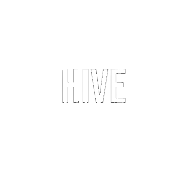

# HiveSite

Welcome to HiveSite! 



<br>

## Installation

### Prerequisites

- Node.js (for SASS compilation)
- npm (Node package manager)

### Steps

1. **Clone the Repository**
    ```sh
    git clone
    cd 
    ```

2. **Install Dependencies**
    ```sh
    npm install
    ```

3. **Compile SASS**
    ```sh
    npm run sass
    ```

4. **Open the Website**
    Open `index.html` in your web browser.


<br>

## Landing Page Screens

### 1st


### 2nd


<br>

## Live Website Demo

Check out the live demo of the Smart Home Website:

[Smart Home Website Live Demo](https://hive-site-yasxeds-projects.vercel.app/)

